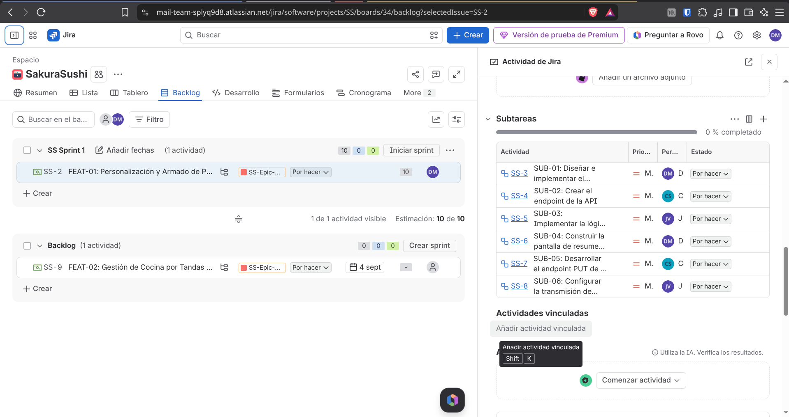

# **Checklist de Actividades en Jira**

|#|ACTIVIDAD EN JIRA|EVIDENCIA|
|:---|:---|:---|
|1|Crear la épica: título, descripción, fecha de vencimiento y etiqueta del concepto||
|2|Crear los 2 features y vincularlos a la épica como hijos||
|3|Crear las 4 historias de usuario con criterios de aceptación en la descripción|   |
|4|Vincular cada historia a su feature correspondiente||
|5|Crear las 12 subtareas (3 por historia), cada una con su historia padre||
|6|Asignar prioridad (Alta / Media / Baja) a cada historia de usuario||
|7|Actualizar scrum_work_restaurante.md con los IDs de Jira (EPIC-XX, STORY-XX, SUB-XX)||
|8|Captura del cronograma / timeline en Jira mostrando la épica completa||

## Planeación del Sprint 1 (Sprint Backlog)

### Justificación de la Selección del Sprint 1

Para el Sprint 1 se seleccionaron las historias **HU-01**, **HU-02**, sumando un total de 
**10 puntos de historia**:

1. **Criterio de Prioridad:** Se priorizaron las historias marcadas con prioridad **Alta**, las cuales componen la columna
vertebral operativa del sistema Sakura Sushi: armar el pedido personalizado, enviarlo a cocina y gestionar su flujo de
estados.
2. **Capacidad y Entrega Temprana de Valor:** Al seleccionar las historias de 5 y 5 puntos, garantizamos un flujo punta 
a punta (MVP) funcional para el cliente, el mesero y la cocina desde la primera iteración.
3. **Gestión de Riesgo:** La **US-03** (8 puntos, Prioridad Media), que corresponde a la agrupación automática por 
tandas en cocina, se desplazó al Sprint 2 para no saturar la capacidad del equipo en esta primera iteración y asegurar
primero la estabilidad del ciclo básico del pedido.