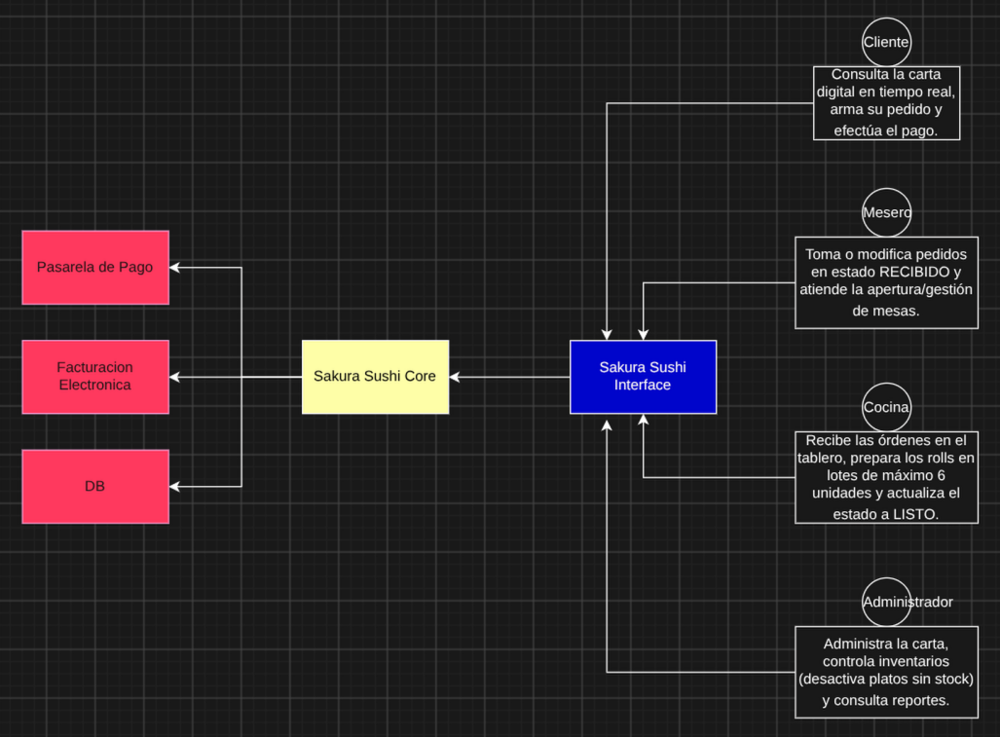

# Alcance del sistema - Sakura Sushi

* **Sistema:** Plataforma Web de Gestion Operativa para Restaurante Japones.
* **Problema a Resolver:** Digitalizar y modernizar la operacion del restaurante para dejar atras las comandas en fisico.
La plataforma conecta en tiempo real la barra de sushi con el salon, asegurando un control preciso del stock de insumos 
frescos y agiliza la gestion de cuentas.
* **Alcance del sistema:**
    * Menu interactivo con actualizacion en vivo del stock de rolls.
    * Registro de pedidos agil e intuitivo, realizable tanto por el cliente como por el mesero.
    * Sincronizacion inmediata con el tablero de la barra de sushi, organizando las comandas por lotes de maximo 6 rolls
  para mantener el ritmo en la cocina.
    * Cierre de cuenta transparente y registro fluido de pagos.
* **Diagrama de Contexto** 